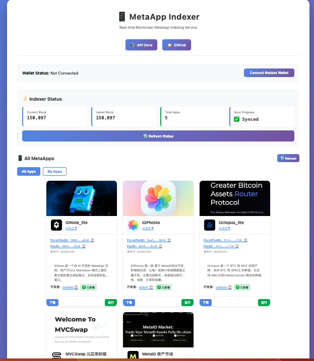

[中文](README-zh.md) | **English**

# Meta App Service

MetaApp Indexer Service - Decentralized application indexing and query service based on MetaID protocol

## Features

- 🔍 **Blockchain Scanning** - Automatically scan BTC/MVC chains and parse MetaID protocol data
- 📦 **App Indexing** - Index and store MetaApp application information
- 🔎 **Query Service** - Provide RESTful API for querying MetaApp
- 📥 **App Deployment** - Support MetaApp deployment and download
- 🌐 **Web Interface** - Provide user-friendly web management interface
- 📚 **API Documentation** - Integrated Swagger documentation

## Quick Start

### Requirements

- Go 1.24+
- PebbleDB (Built-in)
- BTC/MVC node (RPC access)

### Installation

```bash
# Clone repository
git clone https://github.com/metaid-developers/meta-app-service.git
cd meta-app-service

# Install dependencies
go mod download

# Configuration
cp conf/conf_example.yaml conf/conf_loc.yaml
# Edit config file
vim conf/conf_loc.yaml

# Run
go run cmd/indexer/main.go -env loc
```

### Docker Deployment

```bash
docker-compose -f deploy/docker-compose.indexer.yml up -d
```

## Web Interface

After starting the service, access the web interface at `http://localhost:7333` to view and manage MetaApps.



## API Documentation

Access after service starts: `/swagger/index.html`

## Configuration

Main configuration items:

- `indexer.port`: Service port
- `indexer.scan_interval`: Scan interval (seconds)
- `database.data_dir`: Database directory
- `chain.rpc_url`: Blockchain node RPC address

For detailed configuration, please refer to `conf/conf_example.yaml`

## Tech Stack

- **Language**: Go 1.24+
- **Framework**: Gin
- **Database**: PebbleDB
- **Protocol**: MetaID Protocol
- **Blockchain**: BTC/MVC

## License

Apache 2.0
